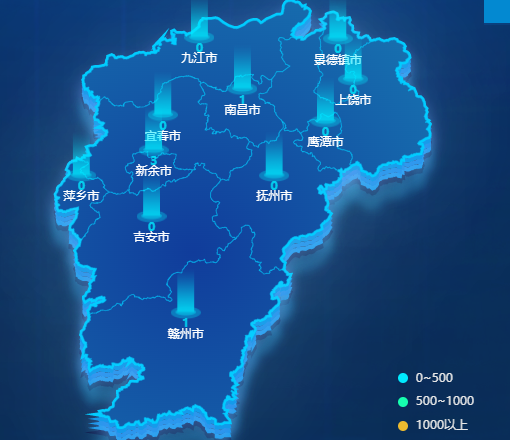

# 地图展示

类似于这种地图效果可以使用echarts实现，但官网案例较少，可借鉴https://www.isqqw.com/?t=map3D，按照教程可实现上述效果，但需要城市数据可以在[阿里云](http://datav.aliyun.com/portal/school/atlas/area_selector)中选择 [json](https://geo.datav.aliyun.com/areas_v3/bound/100000_full.json，)

具体的城市街道，可选择[高德开发平台](https://lbs.amap.com/api/webservice/summary)