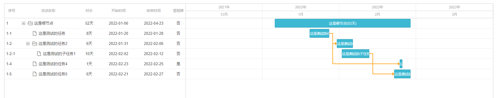
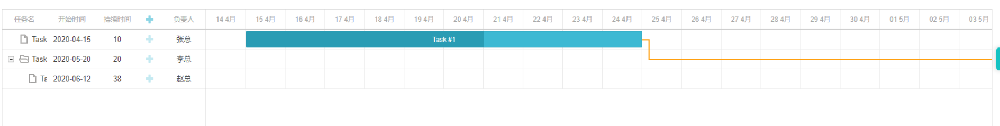

# 甘特图




## 前提

公司项目中有一个甘特图重构的需求，之前用的是普加甘特图，功能都挺全就是丑；金主想要换一个好看点的，于是选择了 `dhtmlx` ，`dhtmlx` 有相对较全别的文档和功能；

在实现需求的同时遇到了很多坑，所以这里记录下

## 安装

```
npm i dhtmlx-gantt
```


### 实例

```
<template>
  <div class="new-page">
    <div ref="gantt" class="gantt-container" />
  </div>
</template>
<script>
import gantt from "dhtmlx-gantt"; // 引入模块
import "dhtmlx-gantt/codebase/dhtmlxgantt.css";
export default {
  name: "DhtmlxGantt-Demo1",
  data() {
    return {
      tasks: {
        data: [
          { id: 1, text: "Task #1", start_date: "15-04-2020", owner: "张总", duration: 10, progress: 0.6 },
          { id: 2, text: "Task #2", start_date: "20-05-2020", owner: "李总", duration: 20, progress: 0.4 },
          { id: 3, text: "Task #2-1", start_date: "12-06-2020", owner: "赵总", duration: 38, progress: 0.4, parent: 2 },
        ],
        links: [{ id: 1, source: 1, target: 2, type: "0" }],
      },
    };
  },
  mounted() {
    //本地化
    gantt.i18n.setLocale("cn");
    // 新增列
    gantt.config.columns.push({
      name: "owner",
      label: "负责人",
      align: "center"
    });
    // 初始化
    gantt.init(this.$refs.gantt);
    // 数据解析
    gantt.parse(this.tasks);
  },
};
</script>

<style scoped>
.gantt-container {
  height: 600px;
}
.new-page {
  height: 100%;
  background-color:#FFF;
  padding: 20px;
  border-radius: 4px;
}
</style>
```




### **问题:**

- 上面的实例看着不错，但是是有问题，没办法交互，只能展示；这个并不符合产品需求；


## 实现

### 可交互

选中一条数据的时候，会触发这个事件；然后就是 vue 常见的组件传值交互了

```js
gantt.attachEvent('onTaskSelected', (id) => {
   let task = gantt.getTask(id)
   this.$emit('task-selected', task)
})
```

### 样式配置

```js
/**
 *
 * @param {甘特图实例对象} gantt
 * 甘特图配置
 */

export function ganttConfigFn (gantt) {
  // 表格列设置---这个只能设置表格，不能处理右边的甘特图展示
  gantt.config.columns = [
    {
      name: "sortId",
      label: "序号",
      align: "left",
      width: "50"
      // tree: true,
      // resize: true,
    },
    {
      name: "taskName",
      label: "活动名称",
      width: "200",
      align: "left",
      tree: true,
      resize: true
    },
    {
      name: "duration",
      label: "时长",
      align: "center",
      width: "80",
      resize: true,
      template: function (obj) {
        return obj.duration + "天"
      }
    },
    {
      name: "taskStartTime",
      label: "开始时间",
      align: "center",
      width: "120",
      resize: true
    },
    {
      name: "taskEndTime",
      label: "结束时间",
      align: "center",
      width: "120",
      resize: true
    },
    {
      name: "isMilestore",
      label: "里程碑",
      align: "center",
      width: "50",
      resize: true,
      template: function (obj) {
        if (obj.isMilestore === '1' || obj.isMilestore === 1) {
          return '是'
        } else {
          return "否"
        }
      }
    }
  ]

  gantt.config.scale_height = 50 // 设置时间刻度的高度和网格的标题
  gantt.config.autosize = true // 甘特图自适应高度
  gantt.config.readonly = true // 表格只读
  // gantt.config.show_grid = false // 隐藏表格
  gantt.config.open_tree_initially = true // 展开树
  gantt.config.grid_width = 600 // 表格宽度

  gantt.config.show_task_cells = true
  gantt.config.xml_date = "%Y-%m-%d"
  // 设置x轴日期
  gantt.config.scale_unit = "month"
  gantt.config.step = 1
  gantt.config.date_scale = "%Y" + "年"
  // 当task的长度改变时，自动调整图表坐标轴区间用于适配task的长度
  gantt.config.fit_tasks = true
  gantt.config.subscales = [
    { unit: "month", step: 1, date: "%M" }
  ]

  /**
   * 任务栏自定义展示信息
   */
  gantt.templates.task_text = function (start, end, task) {
    return task.taskName + "(" + task.duration + "天)"
  }
  gantt.config.fit_tasks = false
  // gantt.templates.grid_open = true

  gantt.templates.tooltip_text = function (start, end, task) {
    return (
      task.taskName + "(" + task.duration + "天)"
    )
  }
  gantt.plugins({
    marker: true, // 竖直标签
    tooltip: true // 悬浮窗
  })
}
}

```


**具体代码**

```js
setGanttData (data) {
      console.log("data:", data)
      /**
       * gantt.clearAll() 清除所有数据
       */
      gantt.clearAll()
      this.tasks.data = []
      this.taskData = data.task
      let linksArr = []

      // 甘特图数据赋值
      data.task.map(item => {
        item.id = item.sortId
        item.taskEndTime = item.taskEndTime || '2022-02-11'
        item.taskStartTime = item.taskStartTime || '2022-02-11'
        // item.progress = 0.8
        item.duration = item.constructionPeriod
        item.start_date = item.taskStartTime
        // item.color = "#fcca02"
        if (item.links && item.links.length > 0) {
          item.links.forEach(item => {
            item.type = item.linkType
            linksArr.push(item)
          })
        }
      })

      // 数据排序 放置 1-2 在 1-1 前面
      taskSort(data)

      // 甘特图排序
      let constructionPlan = data.constructionPlan
      let task = data.task
      const { startTime, endTime, projectName, guid } = constructionPlan
      this.projectName = projectName
      this.endValue = endTime.slice(0, 10)
      this.startValue = startTime.slice(0, 10)
      this.tasks.data = task

      // var links = {id: 1, source: 1, target: 2, type: 0}
      this.tasks.links = linksArr
      this.masterId = guid
    },
```


## 问题

### 父子嵌套

- `parent` 属性 和 `id` 属性是一定要存在的；不能缺少
- 在`columns`中要设置  `tree: true, resize: true`

### 连线

- **id** 属性一定要有

